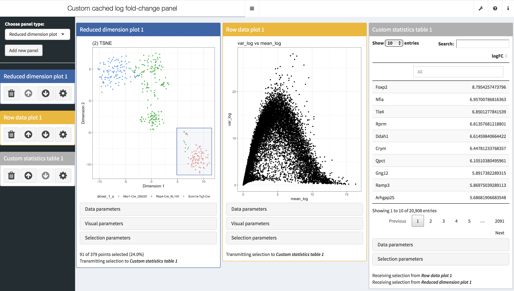

# Examples available

Click on the the image to access the source code.

Screenshot    | Description  
------------- | -------------
 | **Table of log fold-change with cache.** <ul><li>Compute the log fold-change between a selection of samples and all other samples. Restrict the result table to a selection of features.<li>Cache log fold-change values for all features. Only recompute them when the selection of samples changes.<li>Changing the selection of features simply restrict which rows of the cached results are displayed.</ul>
